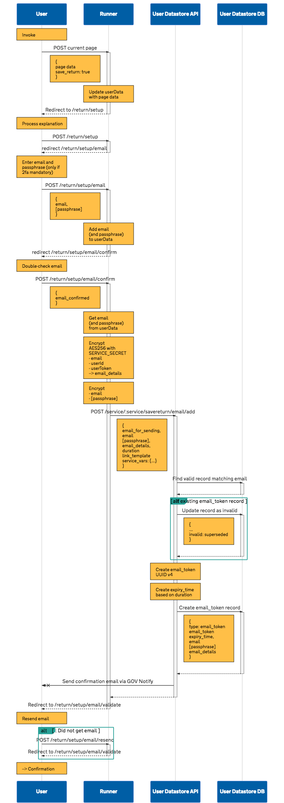
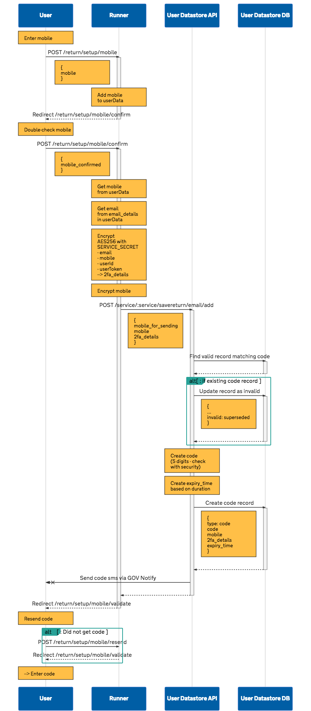
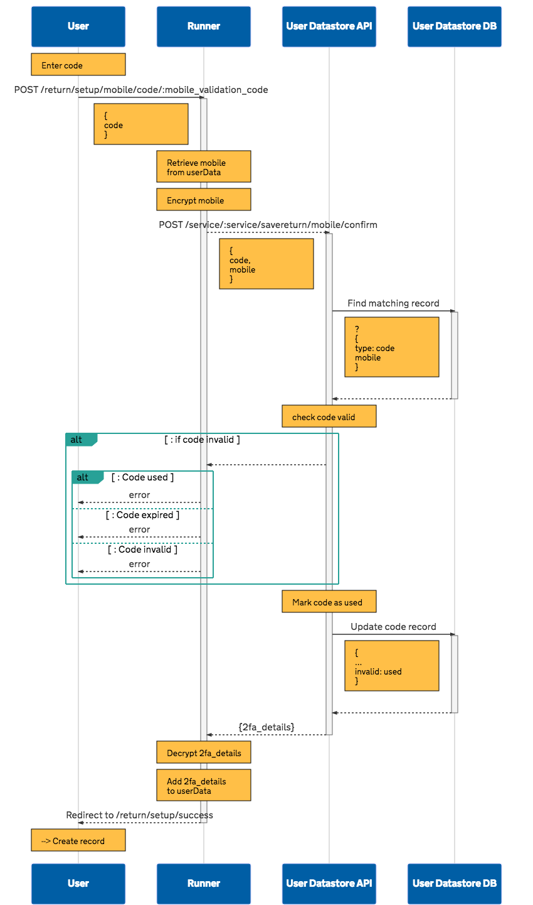
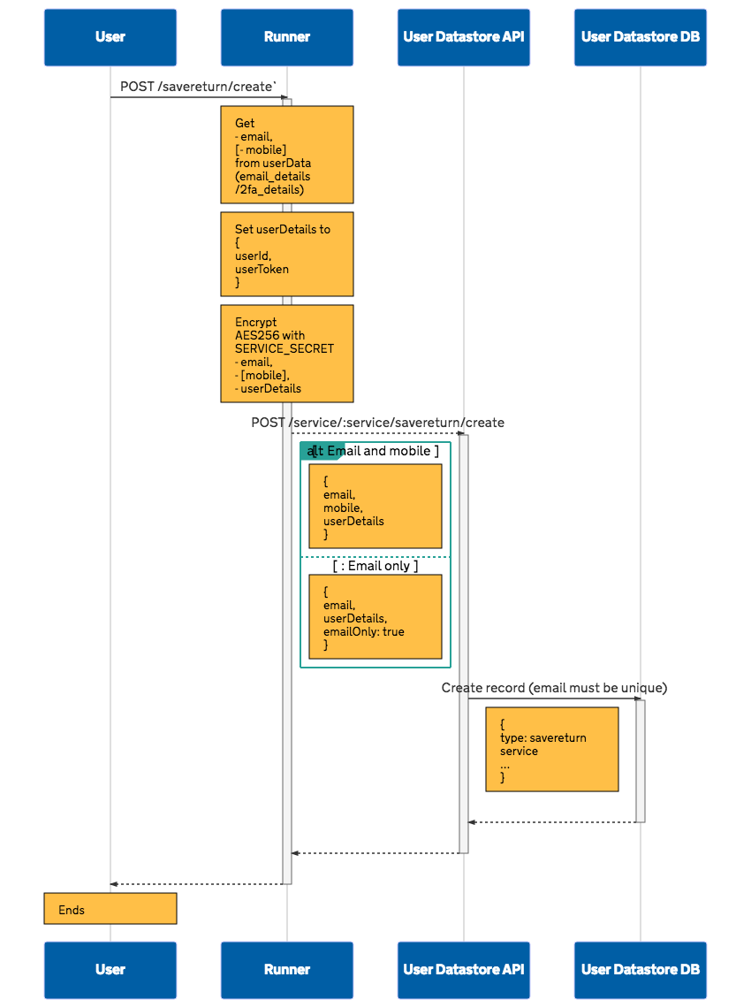
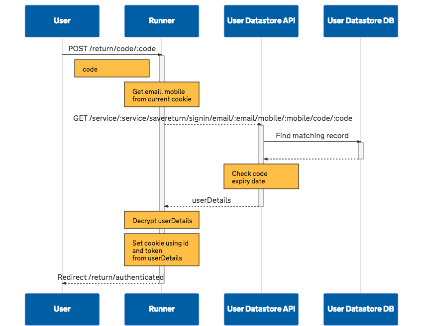

# Save and return

NB. this is still a draft

## TOC

- [Error responses](#error-responses)
- [Signing requests](#signing-requests)

### Save (create return record)

- [Create email token for user to confirm email](#create-email-token-for-user-to-confirm-email)
- [Confirm user’s email](#confirm-users-email-address)
- [Create code for user to confirm mobile](#create-code-for-user-to-confirm-mobile)
- [Confirm user’s mobile](#confirm-users-mobile-address)
- [Create save and return record for user](#create-save-and-return-record-for-user)

### Return

- [Create magiclink for user](#create-magiclink-for-user)
- [Confirm user’s magiclink](#confirm-users-magiclink)
- [Confirm user’s signin code](#confirm-users-signin-code)

## Preface 

### Error responses

Error responses should be sent as JSON - see [Error responses](error-responses.md)

###  Signing requests

Requests should be signed with JWT - see [Signing requests with JWT](request-signing-with-jwt.md)

### Invalidating records


```
{
  ...
  invalid: superseded
}
```

## Save (setup return record)

### Create email token for user to confirm email

- create email token
- invalidate previous tokens
- store encrypted email details
- send email

`POST /service/:service/savereturn/email/add`

Expected body

``` json
{
  "email_for_sending": "<string>",
  "email": "<encrypted_string>",
  "[passphrase]": "<encrypted_string>",
  "email_details": "<encrypted_string>",
  "duration": "<number>",
  "link_template": "<string>",
  "[service_vars]": "<object>"
}
```

#### Mark previous tokens as superseded

#### Generate email_token

UUID v4

#### Generate expiry_time

Current time + duration (minutes|hours?)


#### Create email token record

```
{
  type: "email_token",
  email_token,
  expiry_time,
  email,
  [passphrase],
  email_details
}
```

[](images/return--setup--email-add.svg)

### Confirm user’s email address

- confirm email token validity
- return error codes
- mark email token used
- return encrypted email details

`POST /service/:service/savereturn/email/confirm`

Expected body

``` json
{
  "email_token": "<string>",
  "[passphrase]": "<encrypted_string>"
}
```

[](images/return--setup--email-validation.svg)


### Create code for user to confirm mobile

- create code
- invalidate previous codes
- store encrypted 2fa details
- send sms

`POST /service/:service/savereturn/mobile/add`

[](images/return--setup--mobile-add.svg)

### Confirm user’s mobile

- confirm code validity
- return error codes
- mark code used
- return encrypted 2fa details

`POST /service/:service/savereturn/mobile/confirm`

[](images/return--setup--mobile-validation.svg)

### Create save and return record for user

- create savereturn details

`POST /service/:service/savereturn/create`

[](images/return--setup--create-record.svg)


## Return

### Create magiclink for user

- create magiclink
- invalidate previous magiclinks
- store savereturn key (email)
- send email

`POST /service/:service/savereturn/signin/email/:email`

[](images/return--signin.svg)


### Confirm user’s magiclink

- confirm magiclink validity
- return error codes
- return savereturn details if email only
- create signin code if 2fa
- invalidate previous signin codes
- store savereturn key (email)
- send sms

`POST /service/:service/savereturn/signin/magiclink/:magiclink`

[](images/return--signin--magiclink.svg)


### Confirm user’s signin code

  - confirm siginin code validity
  - return error codes
  - mark signin code used
  - return savereturn details

`POST /service/:service/savereturn/signin/email/:email/mobile/:mobile/code/:code`

[](images/return--signin--code.svg)
